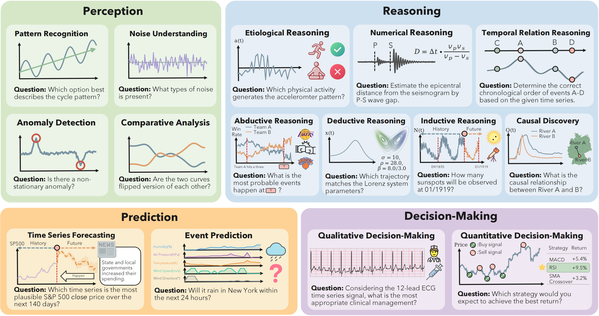

<h1 align="center">
  
  TSRBench: A Comprehensive Multi-task Multi-modal Time Series Reasoning Benchmark for Generalist Models
</h1>

<p align="center">
  📄 <a href="https://arxiv.org/abs/2601.18744"><strong>Paper</strong></a> |  
  🤗 <a href="https://huggingface.co/datasets/umd-zhou-lab/TSRBench"><strong>Dataset</strong></a> |
  🏠 <a href="https://tsrbench.github.io/"><strong>Project Website</strong></a>
</p>

<p align="center">
  <a href="https://yangrui2015.github.io/">Fangxu Yu</a><sup>1</sup>, 
  <a href="https://sites.google.com/view/guoxingang">Xingang Guo</a><sup>2</sup>, 
  <a href="https://lingzhiyxp.github.io/">Lingzhi Yuan</a><sup>1</sup>, 
  <a href="https://mk322.github.io/">Haoqiang Kang</a><sup>3</sup>,
  <a href="https://hzhao.ttic.edu/">Hongyu Zhao</a><sup>1</sup>,
  <a href="https://lianhui.ucsd.edu/">Lianhui Qin</a><sup>3</sup>,
  <a href="https://furong-huang.com/">Furong Huang</a><sup>1</sup>,
  <a href="https://binhu7.github.io/">Bin Hu</a><sup>2</sup>, 
  <a href="https://tianyizhou.github.io/">Tianyi Zhou</a><sup>4</sup>
</p>

<p align="center">
  <sup>1</sup>University of Maryland, College Park &nbsp;
  <sup>2</sup>University of Illinois Urbana-Champaign &nbsp;
  <sup>3</sup>University of California, San Diego &nbsp;
  <sup>4</sup>Mohamed Bin Zayed University of Artificial Intelligence
</p>



## 🔥 Overview 
**TSRBench** is a large-scale, comprehensive benchmark designed to stress-test the **time series understanding and reasoning capabilities** of generalist models (LLMs, VLMs, and TSLLMs). Time series data pervades real-world environments and underpins decision-making in high-stakes domains like finance, healthcare, and industrial systems. However, existing benchmarks often treat time series as isolated numerical sequences, stripping away the semantic context essential for complex problem-solving, or focusing solely on surface-level pattern recognition.

TSRBench is more than a benchmark—it’s a **multifaceted, standardized evaluation platform** that not only uncovers the current challenges in time series reasoning but also provides actionable insights to push the boundaries of time series reasoning.  

## 🚀 **Key Features** 

- 🛠️ **Comprehensive Taxonomy & Scale**: TSRBench categorizes capabilities into 4 major dimensions (Perception, Reasoning, Prediction, Decision-Making) spanning 15 specific tasks. With 4,125 problems from 13 diverse domains.

- 🎯 **Native Multi-Modal Support**: Designed for generalist models, TSRBench supports four distinct modalities: text, image, text-image interleaved, and time series embeddings. 

- 🏹 **Unified Evaluation Pipeline (API & Local)**: We provide a standardized setup to evaluate a wide range of models effortlessly:

  - **Proprietary Models**: Seamless integration with APIs (e.g., GPT-5, Gemini-2.5, DeepSeek).
  - **Open-Source Models**: Local execution support via vLLM for efficient inference.

- 🔍 **Fine-Grained Capability Assessment**: TSRBench evaluates complex cognitive abilities.

### Comparison with related benchmarks

| Benchmark                         | Multi-Dom. | # Tasks | # Questions | Multivariate | Perception | Reasoning | Prediction | Decision  | Modality      |
| --------------------------------- | ---------- | ------- | ----------- | ------------ | ----- | ----- | ----- | ----- | ------------- |
| TimeMMD         | ✅          | 1       | 16K         | ❌            | ❌     | ❌     | ✅     | ❌     | T             |
| CiK        | ✅          | 1       | 0.3K        | ❌            | ❌     | ❌     | ✅     | ❌     | T             |
| TimeSeriesExam  | ❌          | 5       | 0.7K        | ❌            | ✅     | ❌     | ❌     | ❌     | T, V          |
| MTBench       | ✅          | 4       | 2.4K        | ❌            | ❌     | ✅     | ❌     | ❌     | T             |
| EngineMT-QA | ❌          | 4       | 11K         | ✅            | ✅     | ✅     | ❌     | ✅     | T             |
| SciTS           | ✅          | 7       | 51K         | ✅            | ✅     | ❌     | ✅     | ❌     | T             |
| TimeMQA      | ✅          | 5       | 200K        | ❌            | ✅     | ❌     | ❌     | ❌     | T             |
| TSR-SUITE    | ✅          | 4       | 4K          | ❌            | ❌     | ✅     | ✅     | ✅     | T             |
| **TSRBench (Ours)**               | **✅**      | **15**  | **4.1K**    | **✅**        | **✅** | **✅** | **✅** | **✅** | **T, V, T+V** |


## 🖥️ Installation

Download repo
```bash
git clone git@github.com:tianyi-lab/TSRBench.git
cd TSRBench
```

Install VLLM for local inference
```
uv venv myenv --python 3.12 --seed
source myenv/bin/activate
uv pip install vllm
```
Install openai for API inference
```
pip install openai==2.2.0
```

## 🚀 Quick Start
### Proprietary Models
To evaluate the textual time series with LLMs, you could run
```
bash inference/text_gpt/text_inference.sh "your_oai_api_base_url" "your_oai_api_key"
```
To evaluate the visual time series with VLMs, you could run
```
bash inference/vision_gpt/vision_inference.sh "your_oai_api_base_url" "your_oai_api_key"
```
To input both textual and visual time series to VLMs, you could run
```
bash inference/multimodal_gpt/multimodal_inference.sh "your_oai_api_base_url" "your_oai_api_key"
```

### Open-source Models
To evaluate the textual time series with open-source LLMs, you could run
```
bash inference/text_opensource/text_inference.sh
```
To evaluate the textual time series with open-source VLMs, you could run
```
bash inference/vision_opensource/vision_inference.sh
```
You could add more models in the *.sh files

## Citation
```
@inproceedings{
yang2025embodiedbench,
title={EmbodiedBench: Comprehensive Benchmarking Multi-modal Large Language Models for Vision-Driven Embodied Agents},
author={Rui Yang and Hanyang Chen and Junyu Zhang and Mark Zhao and Cheng Qian and Kangrui Wang and Qineng Wang and Teja Venkat Koripella and Marziyeh Movahedi and Manling Li and Heng Ji and Huan Zhang and Tong Zhang},
booktitle={Forty-second International Conference on Machine Learning},
year={2025},
url={https://openreview.net/forum?id=DgGF2LEBPS}
}
```
